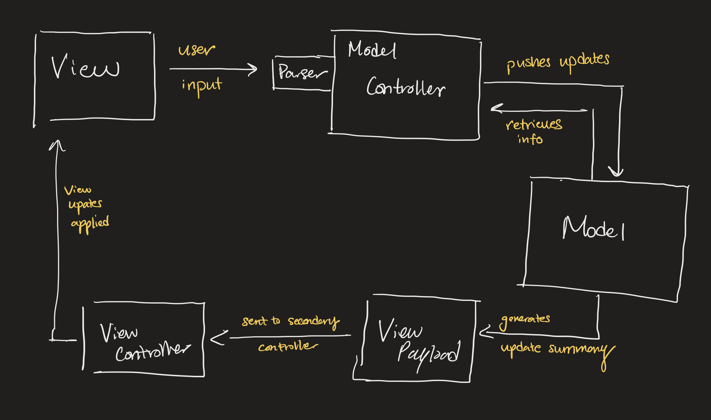

# DESIGN Document for SLogo

## NAME(s) Alec, Aryan, Han, Jack, Yegor

## Role(s)

* Alec
    * Designer/Debugger/Refactorer of:
        * Model
        * View update pipeline
            * ChangeLog
            * ViewCommand
            * ViewPayload
            * ViewController
    * Integrated various parts of MVC design
* Aryan
* Han
* Jack
    * Designer/Implementer/Refactorer/Tester of:
        * Command structures
            * Node
            * Associated Node abstractions
                * Command
                * Constant
                * Group 
                * Root 
                * Variable
            * All associated Command classes
                * avatar 
                    * All commands relevant to avatar movement, rotation, pen behavior
                * control
                    * All commands related to control-loops, setting variables, and custom commands
                * display
                    * All commands related to visual effects, sizes and colors
                * logical
                    * All commands related to logical compututation in math
                * math 
                    * All commands related to mathematical functions (e.g. sine, arctan)
                * multiple 
                    * All commands related to multiple avatars 
                * queries
                    * All commands which are queries
            * Custom commands (UserFunctionTemplate, UserFunctionCommand)
        * Parsing string to commands
            * Parser
                * Includes parsing pre-defined commands, as well as parsing the creation of custom commands
            * Tokenizer
                * Handles whitespaces, comments, newlines
            * TypeChecker
                * Handles all types of tokens
            * TokenType
                * Represents possible token types
        * Util classes for geometry, floating point operations
            * Vector
                * Used for handling vector operations, and related geometrical operations/properties
            * Geometry
                * Used for handling rotations that need decomposition into whole rotations of 360 degrees and residuals
            * Precision
                * Used for handling non-exact logical comparisons that are tolerant to floating point errors
* Yegor

## Design Goals

* Easy to add features:
    * Model
        * New instance variables to describe an Avatar
            * Can be Strings, Booleans, Doubles
            * In the future, could add names, birthdays, hunger, etc.
    * View
        * New ViewCommands to modify the View
            * Can quickly add new View commands that combine other commands or introduce new
              functionality
    * Controller
        * New commands/syntax
    * TypeChecker
        * New types of tokens with unique behavior
    * Parser
        * Parsing new types of tokens with unique behavior
        * Catching undefined behavior and throwing relevant error messages as to why that was unexpected
    * Tokenizer 
        * Handling arbitrary input

## High-Level Design

* The general flow of the program is as follows:
    1. The View collects a user command through the command input box.
    2. The View sends the input to the Parser
    3. The Parser recursively parses the input as a series of expressions, each of which is represented
       by a Node. The recursion follows a depth first order, treating Commands, groups of Commands, 
       Constants, and Variables and arguments to Commands all as expressions within a tree structure.
    4. The Controller receives the parsed tree by the root Node, and links the tree to the Model
    5. The command tree is executed, pulling/setting data in Model as necessary. On the Model side all of these
       changes are staged to make possibility for reversion
    6. If this execution was unsuccessful, Model is reverted to its original state. Otherwise a summary of changes
       is produced by the Model and packaged in a ViewPayload. The ViewPayload contains a set of commands that update
       the View with this new information
    7. The ViewPayload is sent to the ViewController, which generically executes the view commands
       to reflect the new program state.
    8. As each view command applies updates, the View may internally apply transformations to adjust
       coordinates, create animations, etc.
* Major classes for each step:
    * Step 1:
        * `Parser` class - serves to turn raw input into java understandable instructions via 
          abstract syntax tree
    * Step 2: 
        * `Node` abstract class - enforces existence and correct return value of AST execution
    * Step 3:
        * `Controller` class - serves as a coordinator for multiple parts, including Parser, Model,    
          ViewController
    * Step 4:
        * `Model` interface - enforces functionality within different Model implementations to
          ensure that the Controller to properly communicate information.
    * Step 5:
        * `ViewPayload` class - is an encapsulated class that holds a collection of `ViewCommand`
          objects that need to be run to update the view
        * `ViewCommand` abstract class - follows the command pattern, supports a wide variety
          of actions to update different parts of the View
    * Step 6:
        * `ViewController` class - principal controller to modify the View, accepts
          incoming `ViewPayload` objects and generically runs the included commands to update the
          View.
    * Step 7:
        *

## Assumptions or Simplifications

* Parallel representations of an "avatar" in the frontend and backend
    * Creates "duplication", meaning that any updates must be reflected in both places
    * Needed for Model-View separation
    * Helps promote interchangeability between Model and View implementations

* Separate implementations of Model command and View command structures
    * Allows for parallel development with less blocker risk
    * The two command structures have different scopes and complexity, urging separate
      implementations:
        * Conditionals, loops, and custom commands require Model commands to follow an abstract
          syntax tree
        * By contrast, view commands are sequential and involve only known values, requiring only a
          basic structure like a list or queue.
        * Reusing a common command implementation causes either a) the Model commands to be too
          simplistic or b) the view commands to waste much of the built-in complexity needed for
          Model commands.

## Changes from the Plan

* Expanded `Model` API - added upon further research into required commands and during the "change"
  period
    * Addition of new backend fields
        * Visibility
        * Pen enable
        * Color
        * ID
        * Active avatars
        * Total number of avatars
    * Recombination of existing commands
        * SetAvatarPosition (simultaneously set x and y)

## How to Add New Features
* Adding a new language command
  * Add the command in the known commands files for each supported language
  * If the command can be broken down into fundamental subcommands, allow `Parser` to recognize and
    replace the command with the required subcommands
  * If the command requires new information to be stored in the Model
      * Add extra fields to `Avatar`/`Model` (depends on the situation)
      * Add new methods to in the `Model` interface
  * If the command requires new fields to update in the View
      * Add new `ViewCommand` inside `Payload`
      * Add new methods in the `ModelView` interface to allow `GameScreen` to support new methods
  * Note: while there may be many changes, all are simply addition to existing structures
 
* Adding new front end component
  * Initialization and display can be added as `__View` class
  * If the component requires specific information from the Model, add a hidden command to fetch the
    required information through the existing `Parser`-`Controller`-`Model`-`ViewPayload` track
      * Format a special command to fetch the data from the view and disable history logging
  * If the component requires a special data format, add a new `ViewCommand` to format the needed
    structure

* Loading a configuration
    * Implement a file selection window (that code is easily fetched from previous projects)
    * Use the `XMLParser` and filepath to fetch all user configuration settings (colors, animation
      speeds, app styles)
        * Load those into the app, filling any missing fields with default values
    * Use the `XMLParser` to fetch a List of strings representing all user actions/commands
        * Replay each history element sequentially through the command input box to restore the
          program state when it was saved
        * This replay can happen at an increased/instantaneous speed
        * Even trickier histories with custom commands and variables can be restored this way

* Saving a configuration
    * Implement a text input dialog to accept a filename
        * Reject invalid filenames (ones that aren't friendly to file systems)
            * This could include checking for bad characters like spaces or slashes
        * Add a .xml suffix if not present
    * With `XMLParser`, fetch and save desired View settings (color styles, animation speed, etc.)
      under pre-defined
      tags
        * May happen through an interface with the View to prevent the `XMLParser` from reaching all
          over the place for info.
    * With `XMLParser`, fetch and save all user history under a pre-defined tag
        * May happen through an interface with the View to prevent the `XMLParser` from reaching all
          over the place for info.
        * Note: Retrieving all user history is already supported by the Model, just needs to hooked
          up to the other parts
    * Save the file with all the contents and close the stream.
### "Change" Features
* Multiple views
    * Would involve adding a new path to make the Controller run a quick
      fetch command for the desired information (coordinates, etc.)
    * A new ViewCommand subclass would be added to have the View display the results
* Multiple workspaces
    * Isolated to the View side
    * Involved adding a new handler to create new windows
    * Other functionalities would involve adding new copies of existing View elements to a different
      screen.
* Other inputs
    * Would involve creating a new interface to translate any "input" into a
      runnable String in the command input box.
    * For example, arrow keys might translate to "fd 50" or "rt 90", which can be directly inserted
      into the command input box.
    * Or, speech-to-text can convert a spoken command into a runnable String.
    * All the error checking would still exist and the commands would be validated and run as
      usual.

