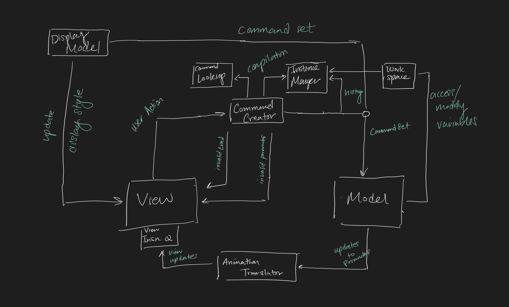

# SLogo Design Plan

### Aryan, Yegor, Alec, Jack, Han

### TEAM 7

#### Examples

Here is a graphical look at my design:

made from [a tool that generates UML from existing code](http://staruml.io/).

Here is our amazing UI:

taken
from [Brilliant Examples of Sketched UI Wireframes and Mock-Ups](https://onextrapixel.com/40-brilliant-examples-of-sketched-ui-wireframes-and-mock-ups/).

## Introduction

The project intends to implement a basic IDE for the SLogo language, a tool intended to teach new
coders about how to code. Our key design goals for this project are to provide a good API, avoid
magic values, catch exceptions ,include encapsulation, and create interfaces.
The primary architecture of this project follows MVC, where we separate the model, view
and controller. 

## Configuration File Format

* Language config file

* Instance functions & variables file

*

## Design Overview

* The design follows MVC format
* The Model is responsible for tracking the internal state of the on-screen objects (locations,
  rotations, etc.) and computing the effects of each command
* The View is responsible for displaying and updating the on-screen objects, accepting user input,
  and changing frontend settings like color schemes.
* The Controller is responsible for parsing user input, throwing format errors, and creating
  instruction payloads for the Model

## Design Details

## Design Considerations

* Whether to do a one-to-one interaction between some central class (Mediator) with all other classes (View, Model, Controller)
or to do it in a cycle (View -> Parser -> Model -> View)

- Pros of bilateral interactions
Can allow some central place to manage all interactions, 
- Cons
Can get complicated with passing from one class to another (e.g. model -> view has to go through mediator)

- Pros of cyclic interactions
Is representative of program flow (user input -> parser -> command -> ...)
- Cons of cyclic interactions

* 

## Test Plan

## Team Responsibilities

* Han Zhang
  - Primary
  - Secondary
* Alec Liu
  - Primary 
  - Secondary 
* Jack Xu
  - Primary 
  - Secondary 
* Yegor Kursakov
  - Primary
  - Secondary
* Aryan Kothari
  - Primary
  - Secondary
