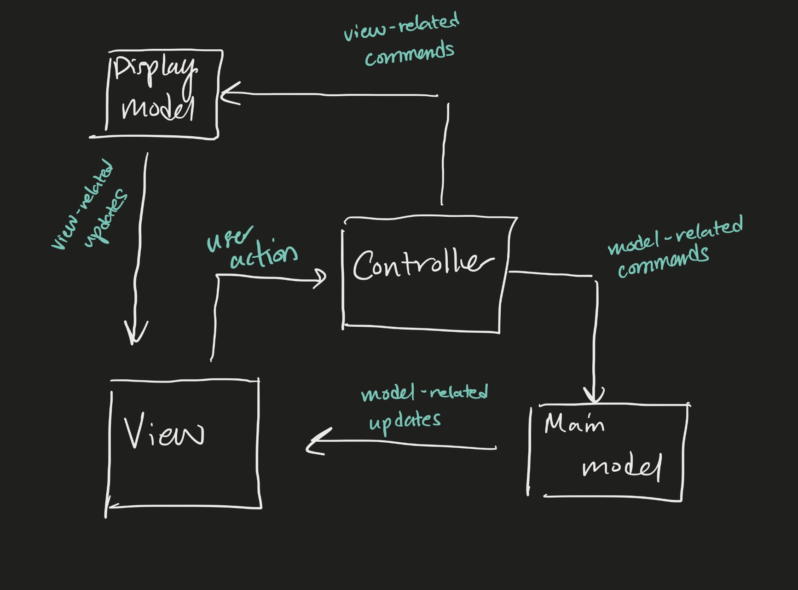
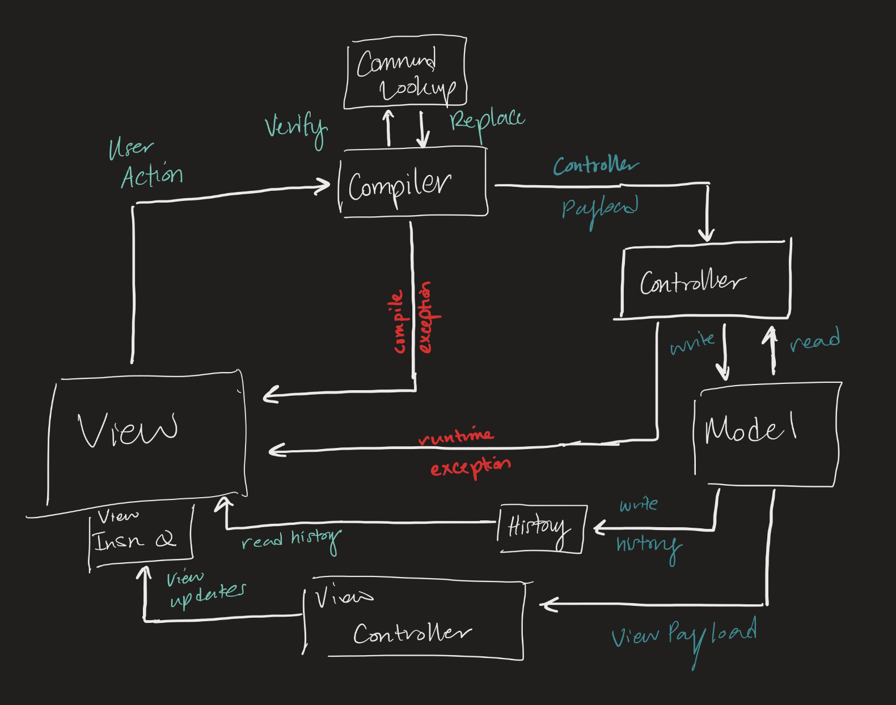

# SLogo Design Plan

### Aryan, Yegor, Alec, Jack, Han

### TEAM 7

## Introduction

The project intends to implement a basic IDE for the SLogo language, a tool intended to teach new
coders about how to code. Our key design goals for this project are to provide a good API, avoid
magic values, catch exceptions ,include encapsulation, and create interfaces.
The primary architecture of this project follows MVC, where we separate the model, view
and controller.

## Configuration File Format

Example 1

```xml

<command>
  <type>single_step</type>
  <name>subtract</name>
  <function-class>Sum</function-class>
  <numparameters>2</numparameters>
  <params>a,b</params>
  <returns>Number</returns>
  <description>Subtracts two numbers</description>
  <documentation></documentation>
</command>
```

Example 2

```xml

<command>
  <type>multi_step</type>
  <name>move square</name>
  <numparameters>2</numparameters>
  <param>a,b</param>
  <commandlist>move up (a), move right (b), move down (a), move left (b)</commandlist>
  <description>Creates a square</description>
  <documentation></documentation>
</command>
```

## Design Overview

* The design follows MVC format
* The Model is responsible for tracking the internal state of the on-screen objects (locations,
  rotations, etc.) and computing the effects of each command
* The View is responsible for displaying and updating the on-screen objects, accepting user input,
  and changing frontend settings like color schemes.
* The Controller is responsible for parsing user input, throwing format errors, and creating
  instruction payloads for the Model
* The Controller abstraction is History
* The View abstractions are Screen, Container, AvatarView.



## Design Details

* The first abstraction is Screen. Screen represents the display that will be seen by the user. The
  screen contains other View classes, and will have an implementation for every time we want to
  change the layout of
  the Screen itself. The Screen supports methods such as makeScene, will set the scene for stage,
  allowing us to switch out
  of those values.
* The second abstraction is Container. Container is any generic grouping of concrete classes such as
  buttons, dropdown, sliders, etc. This abstraction allows us to easily apply CSS styling and not
  let the Screen worry
  about how to attach each concrete class to its Pane, but instead just include the Container's Pane
  into its own Pane.
* The third abstraction is AvatarView. This abstraction allows us to not worry about any future
  changes to what the turtle
  might be or be required to do, but instead guarantee that there will be a way to attach it to the
  Screen abstraction through
  ImageView, and that we can dynamically change the image of the Avatar.
* The fourth abstraction is History. This abstraction contains the data for the previous commands,
  as well as any other
  data that should be stored. This abstraction provides encapsulation so the Model doesn't worry
  about how the History is implemented,
  whether it's a string, list of strings, or anything else. An example is the CommandHistory object
  which extends it, and has a list of strings,
  but maybe for other histories we would want to store variable histories in a key value pair.
* Our ControllerExternalInterface allows us to send parameters such as Language and History from the
  View/Screen , while also letting us take ControllerPayload and ControllerInternalInterface allow
  use to update
  the Controller using ControllerPayload. The features supported are parsing and keeping track of
  user defined data.
  These encapsulations allow us to not worry about how each output of the method
  calls are actually defined.
* Our ModelExternalInterface allows us to read values from the Model, and allows the Controller to
  set the Avatar's various parameters for the purposes of calculation. The ModelInternalIInterface
  allows the model to construct a Payload and update its own values for different variables,
  as well as keep two separate copies of the model in case errors happens on the next command. The
  feature supported
  is running the code pass in through the controller.
* Our NodeExternalInterface allows the Model to be updated based on the commands in the Node trees.
  Because everything is referred to by Classes, the implementation of the Mode and Node don't made
  for the API services
  to still be offered. For the Node Internal Interface we have protected methods that allow the
  Nodes to get their own
  parameters and any data they hold. Each value is encapsulated as much as possible, with all Data
  Structures being referred
  by their interfaces and use of classes we made when possible. The Node allows for the feature of
  organizing for and if
  commands given by the user.
* Out ViewExternalInterface allows the Controller to receive updates on parameters such as language
  and text from DropDown boxes, or speed. The ViewInternalInterfaces allows us to create PopUps,
  update concrete classes such as DropDown, and update visuals of the GUI. These are all relatively
  well encapsulated because
  they all are void methods. These Interfaces support leangauge and style changes to the GUI
  container, PopUps, and modification of animation speed, as well as any other buttons.
  

## Design Considerations

* Whether to do a one-to-one interaction between some central class (Mediator) with all other
  classes (View, Model, Controller)
  or to do it in a cycle (View -> Parser -> Model -> View)

    * Pros of bilateral interactions
        * Can allow some central place to manage all interactions,
    * Cons of bilateral interactions
        * Can get complicated with passing from one class to another (e.g. model -> view has to go
          through mediator)
    * Pros of cyclic interactions
        * Is representative of program flow (user input -> parser -> command -> ...)
    * Cons of cyclic interactions
        * Can bloat the functionality of the Controller class

* Who has the responsibility of running commands on the backend: Model or Controller
    * Pros of Model-based
        * Updates to add new information to be modified are local and easily implementable
            * "Closer" to the variables
        * Reduces the complexity of the overall design
        * Model is made to be a more active class that operates on itself
    * Cons of Model-based
        * More vulnerable to data loss on error or failure
        * Threatens to make Model have too much responsibility
        * Obscures the role of the Controller
    * Pros of Controller-based
        * More clearly separates responsibilities of the Model class
        * Allows Model more room to build in support for backups/copies
    * Cons of Controller-based
        * Reduces the responsibility of the Model class
        * Causes the Model class to expose many getters and setters
        * New access to different information requires updates to getters and setters

* Internal implementation of the Payload Class: Linear or Tree
* A writeup of the Linear Payload format is included in Payload_Format.md
    * Pros of Linear
        * Easy to represent basic sequences of code
        * Straightforward construction during compilation
        * Straightforward iteration while running
    * Cons of Linear
        * Messy to implement control, reducing capacity for complexity
            * May ended up looking like assembly, with "jumps" or "branches"
            * If-statements require a lot of bookkeeping of ids and depth
                * See Payload_Format.md for an example
            * For-loops may just be simply spelled out
                * Not a scalable way to run larger functions
    * Pros of Tree
        * More flexible to complex control structures
            * If,
            * else if,
            * else,
            * switch,
            * for,
            * while
        * More closely models the flow of a complex program
    * Cons of Tree
        * Harder to implement an iterator to traverse the tree
        * Trees have inherent danger of null pointers
        * Complex to develop, requiring a higher `Node` abstraction to navigate the tree
            * As opposed to simply tracking lists of numbers in the Linear implementation
        * Also complex to build, as there is careful consideration of where to append new lines of
          code

## Test Plan

### Testability Strategies

To make our APIs more easily testable, our team discussed the following strategies:

1. Writing smaller classes/methods that we can quickly test in isolation.
2. Defining clear inputs and outputs for each method, including any exceptions that may be thrown.
3. Using dependency injection to allow for the mocking of external dependencies during testing.

### Feature 1: Code Input

Test Scenario 1.1: Successful Run

1. User enters correct code without errors that follows defined syntax patterns and clicks "Run"
   button
2. "Controller" verifies that the code is correct and can successfully run and passes the
   instructions to "Game Screen"
3. Expected outcome: "Game Screen" draws the graphical representation of the code
4. Testing support: We can simulate the successful run by calling the compiler class with valid code
   and checking the returned values ready for drawing. Later on we can check if the valid code is
   correctly drawing the intended image.

Test Scenario 1.2: Compiled Time Exception

1. User enters incorrect code (with an error(s)) and clicks "Run" button
2. "Controller" is trying to verify that the code is correct and can run, determines that there is
   an error and the code cannot, and throws an error.
3. Expected outcome: System displays an error message and prompts user to fix it and try again.
4. Testing support: We can simulate the compiled time exception run by calling the compiler class
   with invalid code and checking for an error to be thrown. Later on we can check if the invalid
   code is prompting an error message.

Test Scenario 1.3: Runtime Exception

1. User enters correct code without errors that follows defined syntax patterns and clicks "Run"
   button (with invalid parameters)
2. "Controller" verifies that the code is correct and can successfully run, tries to run it, and
   throws a runtime error.
3. Expected outcome: System displays a runtime error message and prompts user to fix it and try
   again.
4. Testing support: We can simulate the compiled time exception run by calling the compiler class
   with valid code and invalid parameters values, then checking for an error to be thrown in a
   controller class. Later on we can check if the valid code with invalid parameters is prompting an
   error message.

### Feature 2: Animation Speed Control

Test Scenario 2.1: The Maximum Speed - Speed => Results in No Animation

1. User selects the highest value on the speed slider (by dragging to the right-most) or enter a
   value into a relative text-box that is equal or larger to defined max value.
2. System changes the speed parameter of the running animation and does not run the animation
3. Expected outcome: there is no animation while drawing
4. Testing support: We can simulate immediate image return by passing large enough value to view
   controller as a speed parameter and run sample code, to make sure that there is no animation
   between "Run" button click and final image.

Test Scenario 2.2: Normal Speed - Speed is a positive number

1. User selects a value on the speed slider (by dragging to any value in between left-most and
   right-most) or enters a positive value between 0 and max defined value into a relative text-box.
2. System changes the speed parameter of the running animation relatively ot the input.
3. Expected outcome: the speed of the displayed drawing animation is set, and the animation is
   present
4. Testing support: We can simulate variable animation speed by passing some positive value to view
   controller as a speed parameter and run sample code, to make sure that there is an animation with
   according speed between "Run" button click and final image.

Test Scenario 2.3: String Input

1. User typed in not-intended characters into a speed control text-box.
2. System displays a pop-up error message stating that not-number input is not allowed.
3. Expected outcome: The speed ahs not changed
4. Testing support: we try to pass an invalid value to animation text box and check for it to call a
   pop-up message.

### Feature 3: User Defined Functions

Test Scenario 3.1: Successfully Create Function

1. User defines a new function with correct syntax in the text input field, then clicks "Run".
2. System logs the new function as a command in the user library command structure, then returns.
3. Expected outcome: The user can see the new function in the View, and the user can call the
   function in future inputs.
4. Testing support: We can expose the CommandLookup class to output to the console or GUI directly
   to manually review that the command has been logged with the correct name and parameters.
   Additionally, we can use the InvalidCommandExceptions to check the existence and syntax of the
   newly declared functions.

Test Scenario 3.2: Invalid Name Use

1. After the user has defined a valid function, the user attempts to call that function later, but
   misspells the signature.
2. System attempts to parse the function, fails to find the misspelled function in the library, and
   returns an InvalidCommandException.
3. Expected outcome: The app displays a popup that notifies the user that they have entered an
   invalid name.
4. Testing support: We can expose the CommandLookup class to output to the console or GUI directly
   to manually review the validity of the user input versus their declared function. Additionally,
   we can use the InvalidCommandExceptions to check the existence and syntax of the user functions.

Test Scenario 3.3: Clear User-Defined Functions Library

1. The user clicks a button to clear all user declared functions.
2. The system navigates to the data structure holding the user defined functions and runs a clear
   function.
3. Expected outcome: The user defined functions are no longer visible in the GUI, and any
   attempt to call the functions in code returns and InvalidCommandException
4. Testing support: We can expose the CommandLookup class to output to the console or GUI directly
   to manually review the absence of user defined function. Additionally,
   we can use the InvalidCommandExceptions to check the existence and syntax of the user functions.

### Feature 4: History

Test Scenario 4.1: Code Added to History

1. The user runs a valid input that causes the app to run a few valid functions.
2. The system successfully runs the functions, then logs the payload to the History object.
3. Expected outcome: The user will see a new entry in the HistoryView in the GUI.
4. Testing support: We can use the existing API to receive formatted string lists from the History
   object. This can be used to verify that the correct methods were ran and logged in the correct
   order.

Test Scenario 4.2: Fetching Non-Existent History

1. Upon startup, the user attempts to fetch previous commands.
2. System will attempt to fetch a value from the empty History list, then throw a
   NoHistoryException.
3. Expected outcome: the user will see a popup notifying them that there is no current history.
4. Testing support: We can test around the existing exception to confirm that there is no history.
   Additionally, we can expose certain methods like getSize() to allow the testers to manually
   verify that there are no queued History objects.

Test Scenario 4.3: Fetching Failed Command History

1. The user runs a command that fails, then tries to view that failed command in history.
2. System goes to history and fetches the most recent successful command, ignoring the unsuccessful
   commands.
3. Expected outcome: the user is not able to view a record of the failed command.
4. Testing support: We can use the getHistory() method from the API to return the most recent
   action. We can then verify that the returned History describes the most recent successful command
   instead of the failed command.

## Team Responsibilities

* Han Zhang
    - Primary - GUI, XML
    - Secondary - Parser, ViewController
* Alec Liu
    - Primary - Model implementation and ViewController
    - Secondary - History Queue
* Jack Xu
    - Primary - Controller/Command/Load
    - Secondary - Parser
* Yegor Kursakov
    - Primary - Compiler/Command/Controller
    - Secondary - History, XML
* Aryan Kothari
    - Primary - GUI
    - Secondary - Parser or XML duty

Schedule

* Minimum viable product by each Saturday of the week
* Final integration happens on each Saturday and Sunday
* Meetings occur on either Saturday/Sunday at 9 pm
